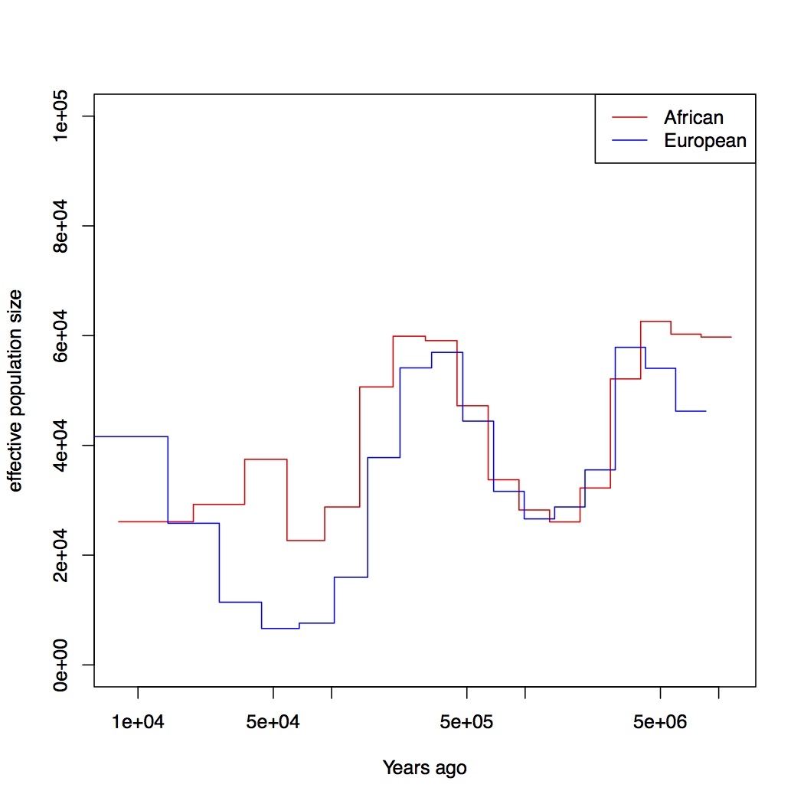
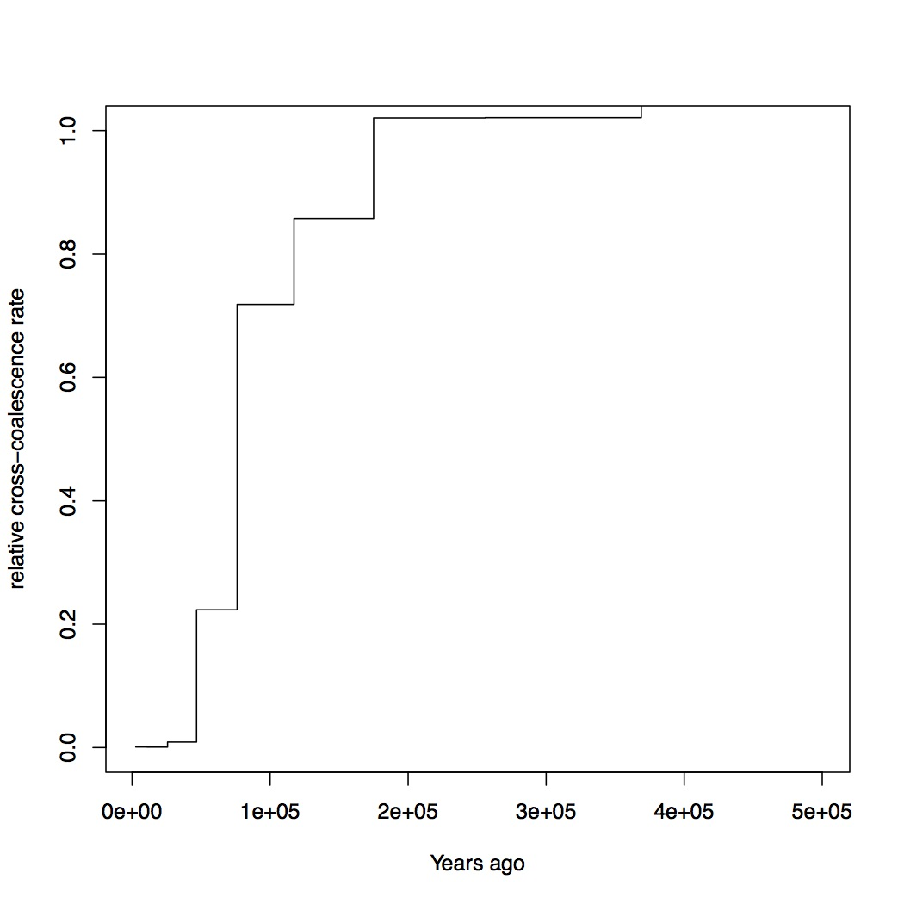
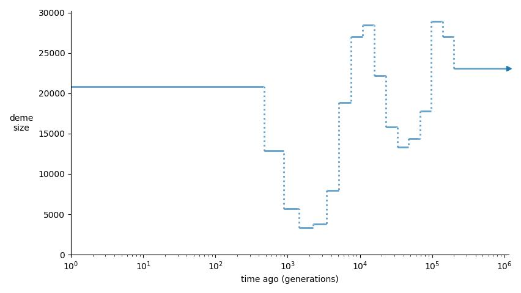

# MSMC Tutorial

## Prerequisites
Download a suitable binary for MSMC2 (Version 2.0.0) from here:

    https://github.com/stschiff/msmc2/releases/tag/v2.0.0

Alternatively, download the source and install yourself.

Download the `msmc-tools` repository, e.g. via `git clone https://github.com/stschiff/msmc-tools.git` if you have `git` installed, or simply as a zip file [here](https://github.com/stschiff/msmc-tools/archive/master.zip).

For this tutorial, I assume that the following executables are in the user's path:

    cgCaller.py
    generate_multihetsep.py
    combineCrossCoal.py
    convert_msmc_to_demes.py
    msmc2

The first three are part of the `msmc-tools` repository, and you should copy those scripts into a location within the path, or create symbolic links to it. The `msmc2` executable should be a renamed binary (Version 2.0.0), or a compiled executable, also somewhere in the path. Note that `combineCrossCoal.py` also requires the [scipy](https://www.scipy.org) package to be installed (for python3).

Finally, for plotting we will use [R](https://www.r-project.org).

## Data

All input data and intermediate files for this tutorial can be found [here](https://share.eva.mpg.de/index.php/s/swpTM4mNK7gG7nw).

For this lesson, we will use two trios from the publically available "69 genomes" data set published by [Complete Genomics](http://www.completegenomics.com/public-data/69-genomes/), which are already included in the tutorial files above. You will find the so called "MasterVarBeta" files for six individuals for chromosome 1 in the `cg_data` subdirectory in the tutorial files. Some information on the six samples: The first three form a father-mother-child trio from the West-African Yoruba, a people living in Nigeria. Here, NA19240 is the offspring, and NA19238 and NA19239 are the two parents. The second three samples form a father-mother-child trio from Utah (USA), with unspecified European ancestry. Here, NA12878 is the offspring, and NA12891 and NA12892 are the parents.

## Generating consensus sequences for each sample

We will use the `masterVar`-files for each of the 6 samples, and use the `cgCaller.py` script in the `msmc-tools` repository to generate a VCF and a mask file for each individual from the `masterVar` file. For this, I suggest you write a little shell script that loops over all individuals:

    #!/usr/bin/env bash
    
    MASTERVARDIR=/path/to/sequence_data
    OUTDIR=/path/to/output_files
    CHR=chr1
    for IND in NA19238 NA19239 NA19240 NA12878 NA12891 NA12892; do
        MASTERVAR=$(ls $MASTERVARDIR/masterVarBeta-$IND-*.tsv.chr1.bz2)
        OUT_MASK=$OUTDIR/$IND.$CHR.mask.bed.gz
        OUT_VCF=$OUTDIR/$IND.$CHR.vcf.gz
        cgCaller.py $CHR $IND $OUT_MASK $MASTERVAR | gzip -c > $OUT_VCF
    done

Here, we restrict analysis only on chromosome 1 (which is called `chr1` in the Complete Genomics data sets). Normally, you would also loop over chromosomes 1-22 in this script.

The line `MASTERVAR=$(ls ...)` uses bash command substitution to look for the masterVar file and store the result in the variable `$MASTERVAR`.

Copy the code above into a shell script, named for example `runCGcaller.sh`, adjust the paths, make it executable via `chmod u+x runCGcaller.sh` and run it. You should see loggin messages indicating the currently processed position in the chromosome. Chromosome 1 has about 250 million sites, so you can estimate the waiting time.

When finished (should take 10-20 minutes for all 6 samples), you should now have one `*.mask.bed.gz` and one `*.vcf.gz` file for each individual.

## Combining samples
 
Some explanation on the generated files: The VCF file in each sample contains all sites at which at least one of the two chromosomes differs from the reference genome. Here is a sample:

    ##fileformat=VCFv4.1
    ##FORMAT=<ID=GT,Number=1,Type=String,Description="Phased Genotype">
    #CHROM	POS	ID	REF	ALT	QUAL	FILTER	INFO	FORMAT	NA19238
    chr1	38232	.	A	G	.	PASS	.	GT	1/1
    chr1	41981	.	A	G	.	PASS	.	GT	1/1
    chr1	47108	.	G	C	.	PASS	.	GT	1/0
    chr1	47292	.	T	G	.	PASS	.	GT	1/0
    chr1	49272	.	G	A	.	PASS	.	GT	1/1
    chr1	51673	.	T	C	.	PASS	.	GT	1/0
    chr1	52058	.	G	C	.	PASS	.	GT	1/0

This alone would not be enough information. MSMC is a Hidden Markov Model which uses the density of heterozygous sites (`1/0` genotypes) to estimate the time to the most recent common ancestor. However, for a density you need not only a numerator but also a denominator, which in this case is the number of non-heterozygous sites, so typically homozygous reference alleles. Those are not part of this VCF file, for efficiency reasons. That's why we have a Mask-file for each sample, that gives information in which regions in the genome could be called. Regions with not enough coverage or too low quality will be excluded. The first lines of such a mask look like this:

    chr1	11093	11101
    chr1	11137	11154
    chr1	11203	11235
    chr1	11276	11288
    chr1	11319	11371
    chr1	11378	11387
    chr1	11437	11453
    chr1	11481	11504
    chr1	11511	11527
    chr1	11568	11637

which gives a very detailed view on which regions could be called (2nd and 3rd column are begin and end).

There is one more mask that we need, which is the mappability mask. This mask defines regions in the reference genome in which we trust the mapping to be of high quality because the reference sequence is unique in that area. The mappability mask for chromosome 1 for the human reference GRCh37 is included in the Tutorial files. For all other chromosomes, this [README](https://github.com/stschiff/msmc-tools/blob/master/README.md) includes a link to download them, but we won't need them in this tutorial.

For generating the input files for MSMC, we will use a script called `generate_multihetsep.py`, which merges VCF and mask files together, and also performs simple trio-phasing. I will first show a command line that generates and MSMC input file for a single diploid sample `NA12878`:

    #!/usr/bin/env bash
    
    INDIR=/path/to/VCF/and/mask/files
    OUTDIR=/path/to/output_files
    MAPDIR=/path/to/mappability/mask
    generate_multihetsep.py --chr 1 --mask $INDIR/NA12878.mask.bed.gz \
        --mask $MAPDIR/hs37d5_chr1.mask.bed $INDIR/NA12878.vcf.gz > $OUTDIR/NA12878.chr1.multihetsep.txt

Here we have added the mask and VCF file of the NA12878 sample, and the mappability mask. I suggest you don't actually run this because we won't need this single-sample processing. 

To process these two trios, we will use the two offspring samples only to phase the four parental chromosomes. You can do this with the trio option:

    #!/usr/bin/env bash
    
    INDIR=/path/to/VCF/and/mask/files
    OUTDIR=/path/to/output_files
    MAPDIR=/path/to/mappability/mask
    generate_multihetsep.py --chr 1 \
        --mask $INDIR/NA12878.chr1.mask.bed.gz --mask $INDIR/NA12891.chr1.mask.bed.gz --mask $INDIR/NA12892.chr1.mask.bed.gz \
        --mask $INDIR/NA19240.chr1.mask.bed.gz --mask $INDIR/NA19238.chr1.mask.bed.gz --mask $INDIR/NA19239.chr1.mask.bed.gz \
        --mask $MAPDIR/hs37d5_chr1.mask.bed --trio 0,1,2 --trio 3,4,5 \
        $INDIR/NA12878.chr1.vcf.gz $INDIR/NA12891.chr1.vcf.gz $INDIR/NA12892.chr1.vcf.gz \
        $INDIR/NA19240.chr1.vcf.gz $INDIR/NA19238.chr1.vcf.gz $INDIR/NA19239.chr1.vcf.gz \
        > $OUTDIR/EUR_AFR.chr1.multihetsep.txt

Here we have first input all 6 calling masks, plus one mappability mask, then the two trio specifications (see `generate_multihetsep.py -h` for details), and then the 6 VCF files.

The first lines of the resulting "multihetsep" file should look like this:

    1	68306	44	TTTCTCCT,TTTCCTTC
    1	68316	10	CCCTTCCT,CCCTCTTC
    1	87563	13	CCTTTTTT
    1	570089	259	TTTTCCCC
    1	752566	1058	AAAAAGAA
    1	752721	83	GGGGGAGA
    1	756781	596	GGGGGGGA
    1	756912	113	AGAAAAAA
    1	757103	26	CCCCCCCT
    1	757734	84	TTTTTCTT

This is the input file for MSMC. The first two columns denote chromosome and position of a segregating site within the samples. The fourth column contains the 8 alleles in the 8 parental haplotypes of the four parents we put in. When there are multiple patterns separated by a comma, it means that phasing information is ambiguous, so there are multiple possible phasings. This can happen if all three members of a trio are heterozygous, which makes it impossible to separate the paternal and maternal allele. 

The third column is special and I get a lot of questions about that column, so let me explain it as clearly as possible: The third column contains the number of called sites _since the previous segregating site, including the current site_. So for example, in the first row above, the first segregating site is at position 68306, but not all 68306 sites up to that site were called homozygous reference, but only 44. This is very important for MSMC, because it would otherwise assume that there was a huge homozygous segment spanning from 1 through 68306. Note that the very definition given above also means that the third column is always greater or equal to 1 (which is actually enforced by MSMC)!

# Running MSMC2

## Estimating the effective population size
MSMC's purpose is to estimate coalescence rates between haplotypes through time. This can then be _interpreted_ for example as the inverse effective population size through time. If the coalescence rate is estimated between subpopulations, another interpretation would be how separated the two populations became through time. In this tutorial, we will use both interpretations.

As a first step, we will use MSMC2 to estimate coalescence rates within the four African haplotypes alone, and within the four European haplotypes alone. Here is a short script running both these cases:

    #!/usr/bin/env bash
    
    INPUTDIR=/path/to/multihetsep/files
    OUTDIR=/path/to/output/dir
    
    msmc2 -t 6 -p 1*2+15*1+1*2 -o $OUTDIR/EUR.msmc2 -I 0,1,2,3 $INPUTDIR/EUR_AFR.chr1.multihetsep.txt
    msmc2 -t 6 -p 1*2+15*1+1*2 -o $OUTDIR/AFR.msmc2 -I 4,5,6,7 $INPUTDIR/EUR_AFR.chr1.multihetsep.txt

Let's go through the parameters one by one. First, the `-t 6` option tells MSMC2 to use 6 CPUs. By default, it will use as many CPUs as there are on your computer. So if you are running this on a high performance compute cluster, it will use all the CPUs on that machine, which is rarely needed. 

Note: It is not useful to use more CPUs than the number of chromosomes times the number of haplotype pairs, because that is the number of parallelised likelihood evaluations. Here I am running on one chromosome on four haplotypes, with six possible haplotype pairings, so that's why I used 6 CPUs.

The `-p 1*2+15*1+1*2` option defines the time segment patterning. By default, MSMC uses 32 time segments, grouped as `1*2+25*1+1*2+1*3`, which means that the first 2 segments are joined (forcing the coalescence rate to be the same in both segments), then 25 segments each with their own rate, and then again two groups of 2 and 3, respectively. MSMC2 run time and memory usage scales quadratically with the number of time segments. Here, since we are only analysing a single chromosome, you should reduce the number of segments to avoid overfitting. That's why I set 18 segments, with two groups in the front and back. Grouping helps avoiding overfitting, as it reduces the number of free parameters.

The `-o` option denotes an output prefix. The three files generated by msmc will be called like this prefix with endings `.final.txt`, `.loop.txt` and `.log`.

The `-I` option denotes the 0-based indices of the haplotypes analysed. In our case we have 8 haplotypes, the first four being of European ancestry, the latter of African ancestry. In the first run we estimate coalescence rates within the European chromosomes (indices 0,1,2,3), and in the second case within the African chromosomes (indices 4,5,6,7). The last argument to `msmc2` is the multihetsep file. Normally you would run it on all 22 chromosomes, and in that case you would simply give all those 22 files in a row.

On four processors, each of those runs will take about 15 minutes.

## Estimating population separation history

Above we have run MSMC on each population individually. In order to better understand when and how the two ancestral populations separated, we will use MSMC to estimate the coalescence rate across populations. Here is a script for this run:

    #!/usr/bin/env bash
    
    INPUTDIR=/path/to/multihetsep/files
    OUTDIR=/path/to/output/dir
    
    msmc2 -t 4 -I 0-4,0-5,1-4,1-5 -s -p 1*2+15*1+1*2 -o $OUTDIR/AFR_EUR.msmc2 $INPUTDIR/EUR_AFR.chr1.multihetsep.txt

OK, so here I am using 4 CPUs (`-t 4`), and I am running on the first two parental chromosomes in each subpopulation. If you wanted to analyse all eight haplotypes (will take consiberably longer), you would have had to say `-I 0-4,0-5,0-6,0-7,1-4,1-5,1-6,1-7,2-4,2-5,2-6,2-7,3-4,3-5,3-6,3-7`.

The `-s` flag tells MSMC to skip sites with ambiguous phasing. As a rule of thumb: For population size estimates, we have found that unphased sites are not so much of a problem, but for cross-population analysis we typically remove those.

## Plotting in R

The result files from MSMC2 look like this:

    time_index	left_time_boundary	right_time_boundary	lambda
    0	0	2.61132e-06	2.93162
    1	2.61132e-06	6.42208e-06	3043.06
    2	6.42208e-06	1.19832e-05	3000.32
    3	1.19832e-05	2.00987e-05	8353.98
    4	2.00987e-05	3.19418e-05	12250.1
    5	3.19418e-05	4.92247e-05	8982.41
    ...

Here, the first column denotes a simple index of all time segments, the second and third indicate the scaled start and end time for each time interval. The last column contains the scaled coalescence rate estimate in that interval. 

Let's first plot the effective population sizes with the following R code:

    mu <- 1.25e-8
    gen <- 30
    afrDat<-read.table("results/AFR.msmc2.final.txt", header=TRUE)
    eurDat<-read.table("results/EUR.msmc2.final.txt", header=TRUE)
    plot(afrDat$left_time_boundary/mu*gen, (1/afrDat$lambda)/(2*mu), log="x",ylim=c(0,100000),
         type="n", xlab="Years ago", ylab="effective population size")
    lines(afrDat$left_time_boundary/mu*gen, (1/afrDat$lambda)/(2*mu), type="s", col="red")
    lines(eurDat$left_time_boundary/mu*gen, (1/eurDat$lambda)/(2*mu), type="s", col="blue")
    legend("topright",legend=c("African", "European"), col=c("red", "blue"), lty=c(1,1))

Obviously, you have to adjust the path to the final result files. The code produces this plot:



You can see that both ancestral population had similar effective population sizes before 200,000 years ago, after which the European ancestors experienced a severe population bottleneck. Of course, this is relatively low resolution because we are only analysing one chromosome, but the basic signal is already visible. Note that here we have scaled times and rates using a generation time of 30 years and a mutation rate of 1.25e-8, which are the same values as used in the [initial publication on MSMC](http://www.nature.com/ng/journal/v46/n8/full/ng.3015.html).

For the cross-population results, we would like to plot the coalescence rate across populations relative to the values within the populations. However, since we have obtained these three rates indepdenently, we have allowed MSMC2 to choose different time interval boundaries in each case, depending on the observed heterozygosity within and across populations. We therefore first have to use a script `combinedCrossCoal.py` available in the [msmc-tools repository](https://github.com/stschiff/msmc-tools), to combine the three rates:

    #!/usr/bin/env bash
    
    DIR=/path/to/msmc/results
    
    combineCrossCoal.py $DIR/EUR_AFR.msmc2.final.txt $DIR/EUR.msmc2.final.txt \
        $DIR/AFR.msmc2.final.txt > $DIR/EUR_AFR.combined.msmc2.final.txt

The resulting file looks like this:

    time_index	left_time_boundary	right_time_boundary	lambda_00	lambda_01	lambda_11
    0	1.1893075e-06	4.75723e-06	1284.0425703	2.24322	2650.59574175
    1	4.75723e-06	1.15451e-05	3247.01877925	2.24322	2940.90417746
    2	1.15451e-05	2.12306e-05	7798.2270432	99.0725	2526.98957475
    3	2.12306e-05	3.50503e-05	11261.3153077	2271.31	2860.21608183
    4	3.50503e-05	5.47692e-05	8074.85679367	4313.17	3075.15793155

Here, instead of just one columns with coalescence rates, as before, we now have three. The first is the rate within population 0, the second across populations, the third within population 1.

OK, so we can now plot the relative cross-coalescence rate as a function of time:

    mu <- 1.25e-8
    gen <- 30
    crossPopDat<-read.table("results/EUR_AFR.combined.msmc2.final.txt", header=TRUE)
    plot(crossPopDat$left_time_boundary/mu*gen, 2 * crossPopDat$lambda_01 / (crossPopDat$lambda_00 + crossPopDat$lambda_11),
         xlim=c(1000,500000),ylim=c(0,1), type="n", xlab="Years ago", ylab="relative cross-coalescence rate")
    lines(crossPopDat$left_time_boundary/mu*gen, 2 * crossPopDat$lambda_01 / (crossPopDat$lambda_00 + crossPopDat$lambda_11), type="s")

which produces this plot:



where you can see that the separation of (West-African) and European ancestors began already 200,000 years ago. The two populations then became progressively more separated over time, reaching a mid-point of 0.5 around 80,000 years ago. Since about 45,000 years, the two population seem fully separated on this plot. Note that even in simulations with a sharp separation, MSMC would not produce an infinitely sharp separation curve, but introduces a "smear" around the true separation time, so this plot is compatible also with the assumption that the two populations where already fully separated around 60,000 years ago, even though the relative cross-coalescence rate is not zero at that point yet.

# Converting to Demes output

You can convert the final MSMC result file, specifically for a single populations, to a Demes model. I provide a script `convert_msmc_to_demes.py` in the [msmc-tools](https://github.com/stschiff/msmc-tools) repository, which takes two command line arguments: 1) the `*.final.txt` output file from MSMC or MSMC2, and a per-generatio mutation rate:

    python3 convert_msmc_to_demes.py results/EUR.msmc2.final.txt 1.25e-8 > results/EUR.msmc2.final.demes.yaml

The results (here written to `results/EUR.msmc2.final.demes.yaml`) are

```{yaml}
# This Demes model was generated by convert_msmc_to_demes.py from https://github.com/stschiff/msmc-tools
description:
Piecewise-constant population size model as inferred by MSMC/MSMC2
time_units: generations
demes:
- name: generic
  epochs:
    - {end_time: 285993, start_size: 23114.840305347043}
    - {end_time: 199777, start_size: 23114.840305347043}
    - {end_time: 139511, start_size: 27022.462421888195}
    - {end_time: 97384, start_size: 28936.022454353428}
    - {end_time: 67936, start_size: 17768.064569146645}
    - {end_time: 47352, start_size: 14391.543529022349}
    - {end_time: 32963, start_size: 13303.444927063863}
    - {end_time: 22905, start_size: 15812.401666627136}
    - {end_time: 15874, start_size: 22209.5134450842}
    - {end_time: 10959, start_size: 28475.83113832135}
    - {end_time: 7524, start_size: 27063.782569570834}
    - {end_time: 5122, start_size: 18889.397853219933}
    - {end_time: 3444, start_size: 7982.550145382194}
    - {end_time: 2270, start_size: 3804.4512079132587}
    - {end_time: 1450, start_size: 3317.9050747358124}
    - {end_time: 877, start_size: 5713.551114856662}
    - {end_time: 476, start_size: 12904.3913643813}
    - {end_time: 196, start_size: 20799.101478816116}
    - {end_time: 0, start_size: 20799.101478816116}
```

You can install the [demesdraw](https://grahamgower.github.io/demesdraw/latest/quickstart.html) software and then conveniently plot this model via

    demesdraw size_history --log-time EUR.msmc2.final.demes.yaml EUR.msmc2.final.demes.jpg

which creates this plot:

